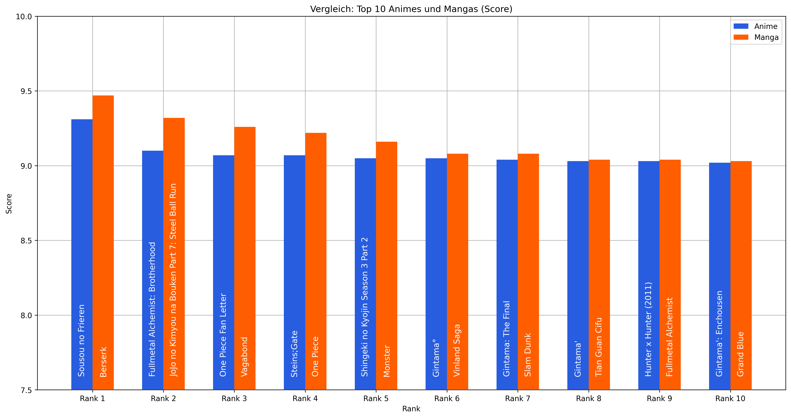
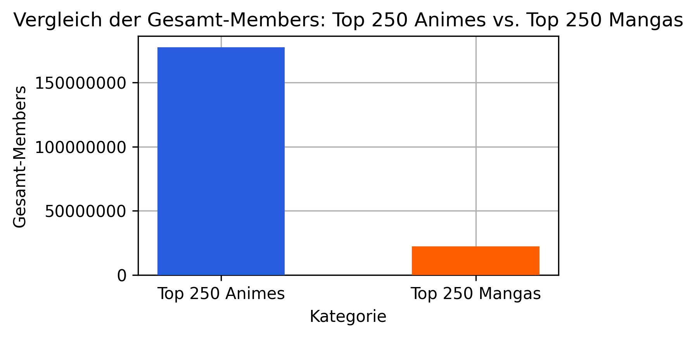
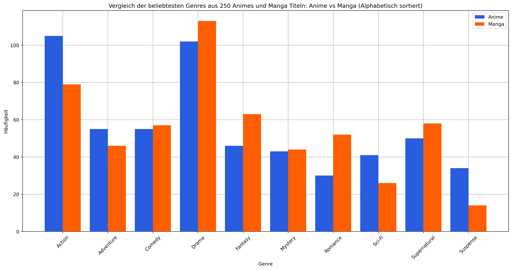
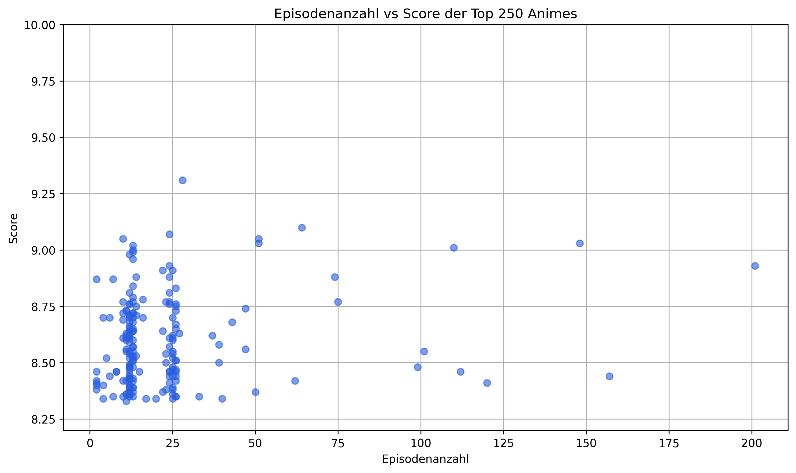
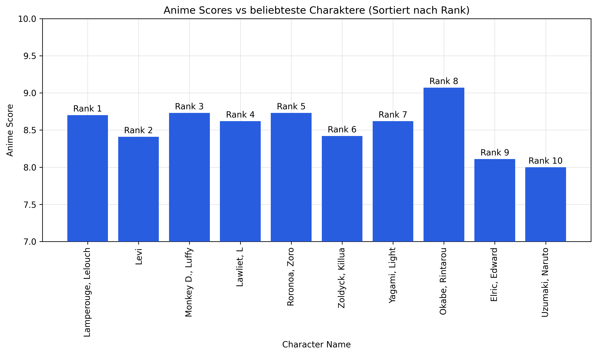

# myanimelist-analyzing

### Live Demo: https://orkzahn.github.io/myanimelist-analyzing/

***
# **Analyse 1:** 

### Sind Animes beliebter als Mangas?

Hypothese: Animes sind warscheinlich beliebter

In diesem Diagramm ist zu erkennen, dass die aktuellen Top 10 Mangas leicht höhere Scores erzielen als die Top 10 Animes.

Wenn man jedoch die Mitgliederzahlen der Top 250 Animes und Mangas vergleicht, zeigt sich deutlich, dass Animes viel häufiger in den Listen der Nutzer erscheinen. Daraus lässt sich schließen, dass Animes insgesamt deutlich beliebter sind.

### **Schlussfolgerung:**
Obwohl Mangas in den Top 10 einen besseren Score haben, zeigt sich insgesamt, dass Animes deutlich beliebter sind. Somit wird die Hypothese bestätigt.

***

***
# **Analyse 2:** 

### Beliebte Genres zwischen Animes und Mangas vergleichen, gibt es unterschiede?

Hypothese: Die beliebtheit der Genres wird unterschiedlich sein

### **Schlussfolgerung:**
Die Ergebnisse zeigen klar, dass sich die Beliebtheit der Genres bei Anime und Manga unterscheidet. Damit wird die Hypothese bestätigt.

***
# **Analyse 3:** 

### Sind Animes mit weniger Episodenanzahl beliebter? Vergleiche die TOP 250 Animes
Hypothese: Animes mit weniger Episodenanzahl sind warscheinlich beliebter

***

### **Schlussfolgerung:**
Die Analyse zeigt, dass Animes mit weniger Episoden (1-25) tendenziell beliebter sind.

# **Analyse 4 (Webscraping):** 

### TOP Anime Charaktere mit Score vergleichen? 

Hypothese: Die beliebtesten Charaktere sind nicht zwangsläufig in den Animes mit den besten Bewertungen zu finden

### **Schlussfolgerung:**
Wie man sieht, hat der Anime des beliebtesten Charakters (Lelouch vi Britannia) einen Score von nur 8.7, während der Anime des achtbeliebtesten Charakters (Okabe Rintarou) mit 9.07 besser abschneidet.

Die Gründe dafür sind unterschiedlich, oft hängt es jedoch mit dem Verlauf des Animes zusammen. Ein schlechtes Ende oder andere unglückliche Entscheidungen, wie der Wechsel von handgezeichneten Animationen zu CGI, können den Gesamteindruck und damit die Bewertung negativ beeinflussen.
